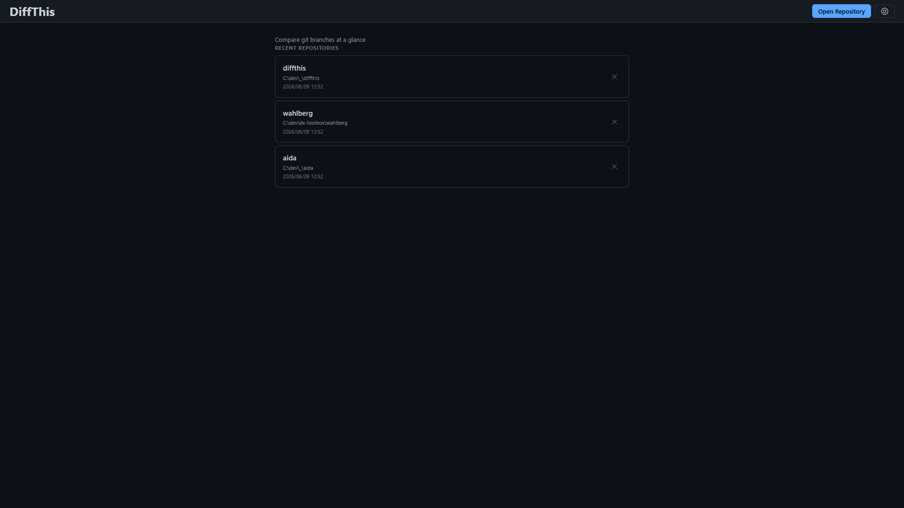
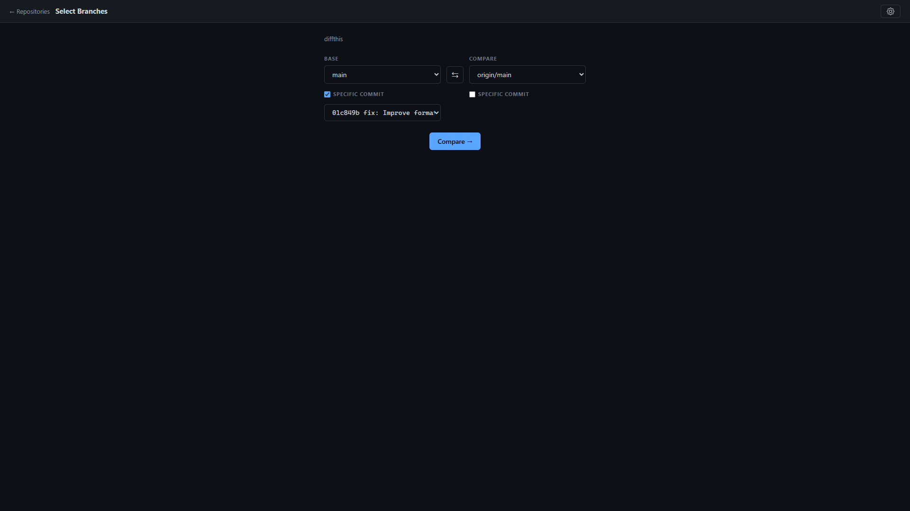
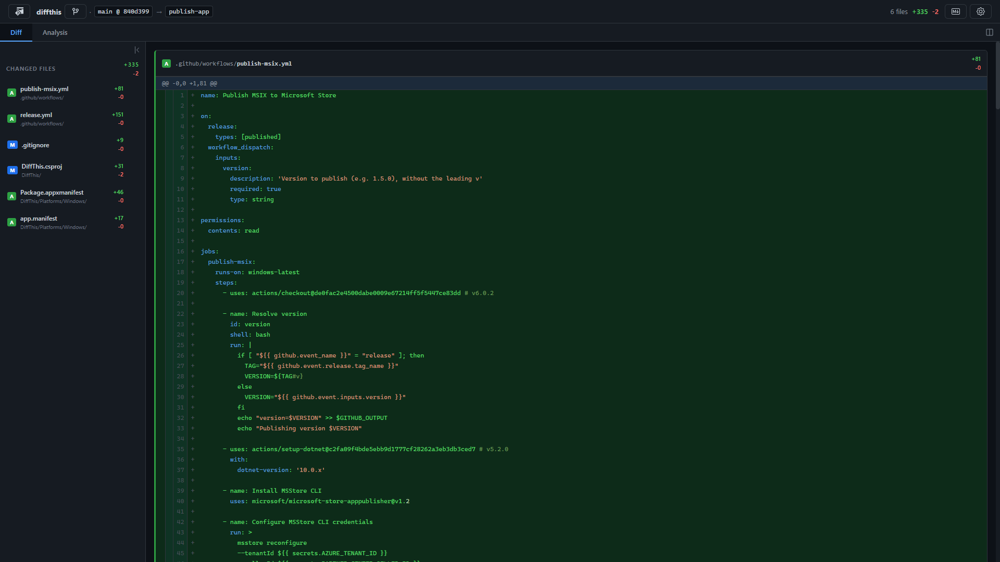
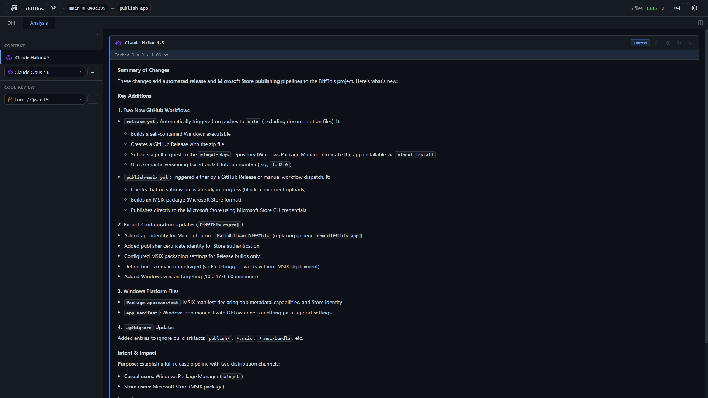
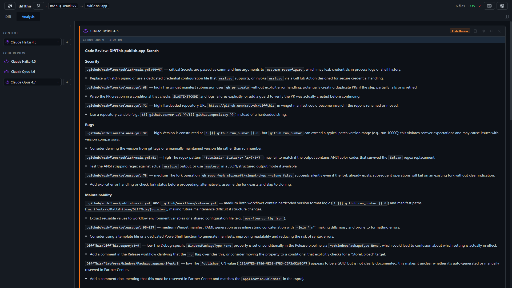
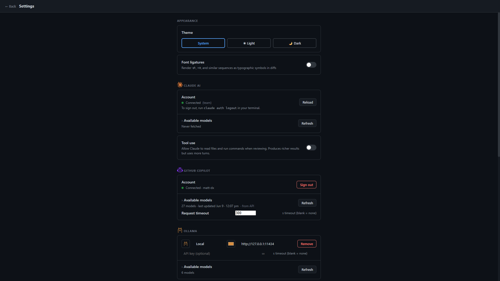

# DiffThis

A Windows desktop diff tool for comparing git branches, with AI-powered code review and explanation.

Built on **.NET MAUI + Blazor Hybrid** targeting `net10.0-windows10.0.19041.0`.

## Features

- Compare any two branches (or pinned commits) in a local git repository
- Syntax-highlighted unified diff with collapsible file sections
- AI review and explanation via **Claude** (Claude Code CLI), **GitHub Copilot**, or **Ollama** (self-hosted)
- Analysis link navigation — AI references to `File.cs:42` are clickable and scroll the diff to that line
- Severity-aware analysis indicators — findings are tagged critical/high/medium/low and displayed with matching intensity
- Configurable diff context depth (3 / 10 / 25 / 50 lines per hunk) for richer AI context
- Markdown export of the full diff
- Per-repo branch selection memory, light/dark theme, font ligature toggle

## Requirements

- Windows 10 (19041+) or Windows 11
- [.NET 10 SDK](https://dotnet.microsoft.com/download/dotnet/10.0) with MAUI workload
- `git` on PATH
- For Claude: [Claude Code CLI](https://claude.ai/code) authenticated (`claude auth login`)
- For GitHub Copilot: a GitHub account with Copilot access (sign-in handled in-app)
- For Ollama: a running [Ollama](https://ollama.com) instance (default `http://localhost:11434`); configure endpoints in Settings

## Installation

### Microsoft Store

Search for **DiffThis** in the Microsoft Store, or install directly:

[](https://www.microsoft.com/store/apps/9MTZD5QS19QM)

## Quick Start

### 1. Open a repository

Click **Open Repository** and select any local git repo folder. Recently opened repos appear on the home screen for quick access.



### 2. Select branches to compare

Pick a **Base** and **Compare** branch from the dropdowns. Optionally check **Specific Commit** on either side to pin the diff to a particular commit. Click **Compare →**.



### 3. Browse the diff

The **Diff** tab shows a file sidebar with add/remove counts and a syntax-highlighted unified diff. Click any file in the sidebar to jump to it. Use the context-lines control (top right) to show more surrounding code.



### 4. Run AI analysis

Switch to the **Analysis** tab. Select a model from the **Context** or **Code Review** dropdowns and click **+** to generate a result. Results are cached — re-opening the same diff is instant.



AI findings that reference specific files (e.g. `Services/GitService.cs:42`) are rendered as clickable links that scroll the diff to that exact line.



### 5. Connect an AI provider

Open **Settings** (gear icon, top right) to sign in to Claude or GitHub Copilot, or add an Ollama endpoint. Once connected, available models are fetched automatically.



- **Claude** — requires [Claude Code CLI](https://claude.ai/code) installed and authenticated (`claude auth login` in a terminal)
- **GitHub Copilot** — sign in with your GitHub account directly from the Settings page
- **Ollama** — add a base URL (e.g. `http://localhost:11434`) for any running Ollama instance

## Build & Run

```bash
# Debug
dotnet build DiffThis\DiffThis.csproj -f net10.0-windows10.0.19041.0

# Release
dotnet build DiffThis\DiffThis.csproj -f net10.0-windows10.0.19041.0 -c Release

# Run
dotnet run --project DiffThis\DiffThis.csproj -f net10.0-windows10.0.19041.0

# Tests
dotnet test DiffThis.AI.OpenAI.Tests\DiffThis.AI.OpenAI.Tests.csproj
```

The target framework must always be specified explicitly for the MAUI project. In debug builds, Blazor DevTools are accessible via F12.

## Project Structure

```text
DiffThis/                       MAUI app host (entry point)
DiffThis.UI/                    Razor components, pages, panels
DiffThis.Core/                  Domain models (DiffResult, DiffFile, DiffHunk, DiffLine)
DiffThis.AI.Shared/             PromptService, AiCacheService, AnalysisLinkService, DiffSessionService
DiffThis.AI.Claude/             Claude CLI integration
DiffThis.AI.OpenAI/             GitHub Copilot + Ollama integration (OpenAI-compatible API)
DiffThis.AI.OpenAI.Tests/       Integration tests for Copilot services
```

Key files:

```text
DiffThis/
├── MauiProgram.cs              DI registration; DevTools in debug
└── MainPage.xaml               Hosts the BlazorWebView

DiffThis.UI/Components/Pages/
├── Home.razor                  Repo folder picker
├── BranchSelection.razor       Branch + commit-pin pickers; triggers diff
├── MainView.razor              Side-by-side / tabbed layout for diff + analysis
└── Settings.razor              App settings

DiffThis.UI/Components/Panels/
├── DiffPanel.razor             File sidebar + collapsible diff tables + syntax highlighting
└── AnalysisPanel.razor         AI result cards; analysis link rendering

DiffThis.UI/wwwroot/
├── app.css                     CSS variables for syntax token colours (light/dark)
└── app.js                      JS interop: scrollToElement, copyToClipboard, analysis link callback
```

## AI Providers

### Claude

Uses the `claude` CLI as a subprocess (diff passed on stdin). Requires [Claude Code](https://claude.ai/code) to be installed and authenticated via `claude auth login`. Model list is fetched from the Anthropic API using your CLI credentials.

### GitHub Copilot

Calls the GitHub Copilot chat completions API directly. Sign in with your GitHub account from the Settings page — DiffThis handles the device-code OAuth flow and session token refresh automatically. Requires a GitHub account with Copilot access.

### Ollama

Calls a local (or remote) Ollama instance via its `/api/chat` endpoint. Add one or more endpoints in Settings (name, base URL, optional API key, optional per-endpoint timeout). DiffThis fetches available models from each endpoint and lets you pull new models directly from the UI. The context window (`num_ctx`) is sized automatically based on the prompt length to avoid truncation.

## AI Prompts

Custom prompt templates can be placed at `%LOCALAPPDATA%\DiffThis\prompts\review.md` or `explain.md`. Use `{{Variable}}` placeholders — the built-in templates in `DiffThis.AI.Shared/Prompts/` show available variables.

Available placeholders:

| Placeholder | Value |
| --- | --- |
| `{{RepositoryName}}` | Repo folder name |
| `{{BaseDisplay}}` | Human-readable base ref label |
| `{{CompareDisplay}}` | Human-readable compare ref label |
| `{{FileCount}}` | Number of files changed |
| `{{Additions}}` | Total lines added |
| `{{Deletions}}` | Total lines deleted |
| `{{FileList}}` | Changed files with status and detected language |
| `{{DiffContent}}` | Full unified diff (truncated at 60 k chars) |

## Diff Context Depth

The number of context lines shown per hunk (equivalent to `git diff --unified=N`) is configurable from Settings → Diff → Context lines. Options: 3 (minimal, default), 10 (standard), 25 (extended), 50 (full). More context lines give the AI more surrounding code to reason about, at the cost of longer diffs and higher token usage.

## AI Result Caching

AI results are cached at `%LOCALAPPDATA%\DiffThis\ai-cache.json` (max 500 entries, LRU-evicted). The cache key includes repo path, base/compare refs, feature, model, tools-enabled flag, and max-turns — changing any of these produces a fresh run.
